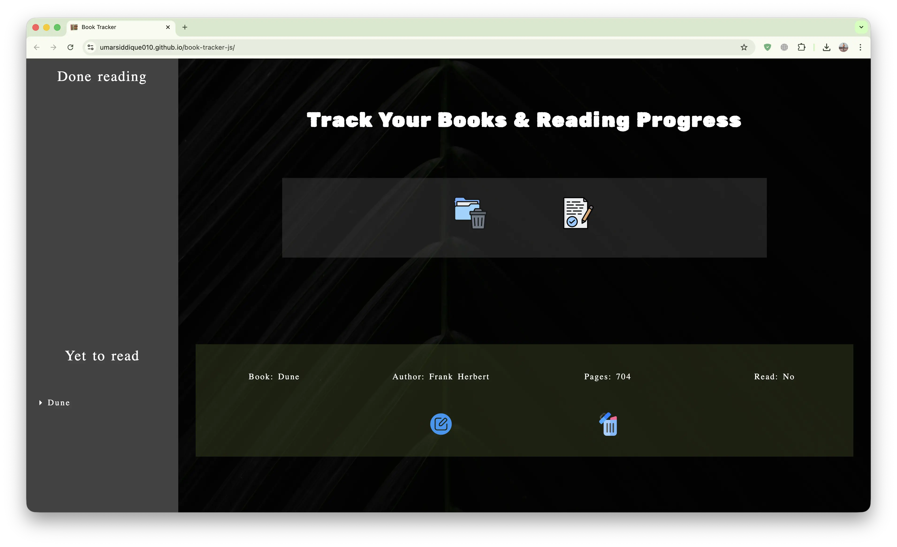

#  Book Tracker JS

<div align="center">

### Modular Book Tracker SPA.

<p align="center">
  <strong>A framework-free Single Page Application built with modern Vanilla JavaScript,
  focusing on Object-Oriented Architecture, real DOM manipulation, and comprehensive unit testing.</strong>
</p>

<p align="center">
  <a href="https://umarsiddique010.github.io/book-tracker-js/"><strong>View Live Production Deployment</strong></a>
  &nbsp;&nbsp;&bull;&nbsp;&nbsp;
  <a href="#getting-started"><strong>Local Setup</strong></a>
  &nbsp;&nbsp;&bull;&nbsp;&nbsp;
  <a href="https://github.com/umarSiddique010/book-tracker-js"><strong>Repository</strong></a>
  &nbsp;&nbsp;&bull;&nbsp;&nbsp;
  <a href="https://github.com/umarSiddique010/book-tracker-js/issues"><strong>Report an Issue</strong></a>
</p>

[](https://developer.mozilla.org/en-US/docs/Web/JavaScript)
[](https://developer.mozilla.org/en-US/docs/Web/css)
[](https://webpack.js.org/)
[](https://vitest.dev/)
[](https://pages.github.com/)

</div>

---

## Overview

**Book Tracker JS** demonstrates advanced frontend fundamentals by building a robust SPA from scratch — no React, no Vue, no jQuery. A strict **modular OOP architecture** manages state, handles persistent storage, and manipulates the DOM with full control over the rendering lifecycle.

Users can add books, track read status, filter by "Done" vs "Yet to Read", and manage their library — all persisted across sessions via `localStorage`.

## Application Preview



## Features & Architecture

### 1. Object-Oriented Architecture

The codebase is strictly divided into single-responsibility classes — no logic bleeds between layers:

- **`AddBooks`** — Book model/entity class
- **`BookStore`** — Static class; sole owner of `localStorage` read/write
- **`BookStateManagement`** — CRUD logic: add, delete, edit read status
- **`RenderTracker`** — Main book grid renderer
- **`RenderForm`** — Dynamic form generator
- **`RenderBasicUI`** — Layout skeleton
- **`UtilityModule`** — Custom `createElement` wrapper + toast notification system
- **`InputField`** — Form handling with guard clauses and validation
- **`Aside`** — Responsive sidebar with hamburger toggle

### 2. MVC-Lite Pattern

| Layer | Classes | Responsibility |
| :--- | :--- | :--- |
| **Model** | `BookStore`, `BookStateManagement` | Data logic and `localStorage` I/O |
| **View** | `RenderTracker`, `RenderForm`, `RenderBasicUI` | DOM creation and updates |
| **Controller** | `InputField` | Bridges user input and state updates |

### 3. Key Technical Features

- **Pure DOM manipulation** — programmatic UI via custom `UtilityModule.createElement`, zero `innerHTML`
- **Event delegation** — single listener on parent containers; dynamically added elements inherit behavior without redundant bindings
- **Toast notification system** — animated user feedback for every CRUD operation, built from scratch
- **Responsive sidebar** — hamburger menu toggle on mobile, filter by read status
- **Form validation** — defensive guard clauses in `InputField.js` prevent invalid data entry

### 4. Testing

- **Unit tests** — isolated class logic (`AddBooks`, `BookStore`, `UtilityModule`)
- **Integration tests** — interaction between `BookStateManagement` and `RenderTracker`
- **DOM tests** — form renders, button clicks, sidebar toggle via `jsdom` + `@testing-library/dom`
- **Coverage** — enforced via `npm run test:coverage`

## Tech Stack

| Category | Technology | Usage |
| :--- | :--- | :--- |
| **Language** | **JavaScript (ES6+)** | Classes, modules, async/await |
| **Markup** | **HTML5 + CSS3** | CSS variables, flexbox, grid |
| **Bundler** | **Webpack 5** | Asset modules, CSS loaders, HTML plugin, dev server |
| **Testing** | **Vitest + jsdom** | Unit, integration, and DOM tests |
| **Test Utilities** | **@testing-library/dom** | DOM assertions and event simulation |
| **Hosting** | **GitHub Pages** | Manual deployment via `npm run deploy` |

## Getting Started

### Prerequisites

- Node.js v16+
- npm

### 1. Clone & Install

```bash
git clone https://github.com/umarSiddique010/book-tracker-js.git

cd book-tracker-js

npm install
```

### 2. Run Development Server

```bash
npm start
```

Open [http://localhost:8080](http://localhost:8080). Webpack Dev Server with hot reloading.

### 3. Run Tests

```bash
# Full test suite
npm test

# With coverage
npm run test:coverage
```

### 4. Build for Production

```bash
npm run build
```

Outputs optimized files to the `build/` directory.

### 5. Deploy to GitHub Pages

```bash
npm run deploy
```

> Runs `npm run build` then pushes to the `gh-pages` branch. Deployment is manual — run only after tests pass.

## Project Structure

```
src/
├── __test__/               # Vitest test suites
├── asset/                  # SVG icons and images
├── css-components/         # Per-component CSS files
├── js-components/
│   ├── data/               # Static config data
│   ├── AddBooks.js         # Book model
│   ├── Aside.js            # Responsive sidebar
│   ├── BookStateManagement.js  # CRUD logic
│   ├── BookStore.js        # localStorage wrapper
│   ├── InputField.js       # Form handling and validation
│   ├── RenderBasicUI.js    # Layout skeleton
│   ├── RenderForm.js       # Dynamic form generator
│   ├── RenderTracker.js    # Book grid renderer
│   └── UtilityModule.js    # DOM helpers + toast system
├── index.js                # Entry point
├── style.css               # Global variables and reset
└── template.html           # HTML shell
```

---

<div align="center">

### Developer & Maintainer

**Md Umar Siddique**

<p align="center">
  <a href="https://www.umarsiddique.dev/">
    
  </a>
  <a href="https://www.linkedin.com/in/md-umar-siddique-1519b12a4/">
    
  </a>
  <a href="https://github.com/umarSiddique010">
    
  </a>
  <a href="https://www.npmjs.com/~umarsiddique010">
    
  </a>
  <a href="https://dev.to/umarsiddique010">
    
  </a>
 <a href="mailto:us70763@gmail.com">
  
</a>
</p>

&copy; 2024 - Present. Released under the MIT License.

</div>